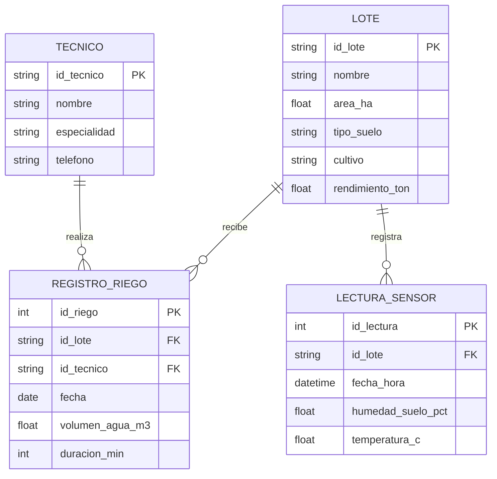

# Actividad Práctica · Semana 6
## Modelamiento de datos (ERD de tu caso)
### 🌱 Gestión del Riego Agroindustrial basada en Datos

```yaml
# CONFIG
FULL_NAME: Isabella Ramos Betancourt
GITHUB_USER: Isarb-21
```

**Isabella Ramos Betancourt**  
Facultad de Ingeniería, Corporación Universitaria del Huila (CORHUILA)  
Ciencia de Datos (Cód. 69109) [Pénsum 40D, Grupo 1]  
Jesús Ariel Gonzáles Bonilla  
Octubre de 2026  

---

## 1. Introducción

En el proceso de análisis de datos, antes de realizar cualquier tipo de consulta, análisis o visualización, es fundamental organizar y estructurar la información disponible. Como plantean Elmasri y Navathe (2016), el modelamiento de datos define las entidades, los atributos y las relaciones que componen el sistema, funcionando como el plano principal que asegura la coherencia de la base de datos antes de su implementación física.

En la Actividad del Corte 1 se analizó la problemática de la **Gestión del Riego Agroindustrial**, donde la falta de datos oportunos genera desperdicio de agua por riego excesivo o pérdidas en el cultivo por estrés hídrico. De acuerdo con la FAO (2026), contar con registros confiables sobre el agua y el monitoreo continuo de variables operativas es indispensable para mejorar la productividad en los sistemas agroalimentarios. A partir de ello, se formuló la pregunta central de datos:

> *«¿Cómo se pueden utilizar los datos de humedad del suelo, temperatura y consumo de agua para mejorar la programación del riego y optimizar el rendimiento de los cultivos?»*

El propósito de esta actividad es diseñar el **Modelo Entidad-Relación (ERD)** del caso práctico, definiendo las entidades con sus respectivas claves primarias (PK) y foráneas (FK), incluyendo las variables necesarias para responder plenamente a la pregunta planteada: consumo de agua, humedad del suelo, temperatura ambiental y rendimiento del cultivo. Asimismo, se incluye una relación de muchos a muchos (N:M) resuelta mediante una tabla intermedia (Elmasri & Navathe, 2016), se justifica la selección de un enfoque relacional frente a uno NoSQL (IBM, 2024) y se explica la aplicación de la normalización básica para evitar la duplicación de información.

---

## 2. Desarrollo de la actividad

### 2.1. Diseño del ERD (Entidades, PK/FK y Relaciones)

A partir del caso de estudio y de las necesidades operativas identificadas por la FAO (2026) en la gestión del agua agrícola, se definen cuatro entidades para registrar la información de campo, el monitoreo ambiental y los resultados productivos:

#### Entidades y Atributos:
1. **`Lote` (Entidad principal):** Representa cada una de las parcelas de la finca y su resultado de producción.
   * `id_lote` (**PK**): Clave primaria que identifica de forma única al lote (Elmasri & Navathe, 2016).
   * `nombre`: Denominación o código del lote (ej. Lote Norte, Tablón 3).
   * `area_ha`: Extensión territorial en hectáreas.
   * `tipo_suelo`: Textura del suelo (Arcilloso, Arenoso, Franco), determinante para la retención de agua.
   * `cultivo`: Tipo o variedad de cultivo sembrado (ej. Café, Maíz).
   * `rendimiento_ton`: Rendimiento final de la cosecha obtenido en la parcela en toneladas métricas.

2. **`Tecnico` (Entidad principal):** Operario o profesional encargado de supervisar o ejecutar el riego.
   * `id_tecnico` (**PK**): Clave primaria única del técnico.
   * `nombre`: Nombre y apellido del operario.
   * `especialidad`: Función asignada (Operador de riego, Agrónomo).
   * `telefono`: Número de contacto para emergencias operativas.

3. **`Registro_Riego` (Tabla intermedia asociativa N:M):** Registra cada evento de irrigación y el consumo hídrico aplicado.
   * `id_riego` (**PK**): Clave primaria de cada labor de riego.
   * `id_lote` (**FK**): Clave foránea que referencia a la tabla `Lote`.
   * `id_tecnico` (**FK**): Clave foránea que referencia a la tabla `Tecnico`.
   * `fecha`: Fecha de realización del evento de riego.
   * `volumen_agua_m3`: Consumo de agua medido en metros cúbicos ($m^3$).
   * `duracion_min`: Tiempo que permaneció abierto el sistema de riego en minutos.

4. **`Lectura_Sensor` (Entidad de telemetría y monitoreo ambiental):** Captura las mediciones continuas de suelo y clima en cada parcela.
   * `id_lectura` (**PK**): Identificador secuencial de la lectura.
   * `id_lote` (**FK**): Parcela donde se realizó la medición (`Lote.id_lote`).
   * `fecha_hora`: Marca temporal exacta de la medición.
   * `humedad_suelo_pct`: Porcentaje de humedad registrado en el suelo (%).
   * `temperatura_c`: Temperatura registrada en grados Celsius (°C).

---

#### Relaciones del Modelo:

* **Relación N : M (Muchos a Muchos) resuelta con tabla intermedia:**
  * **Situación:** A lo largo de la temporada, un `Lote` recibe riego en distintas fechas por parte de **muchos técnicos** según sus turnos de trabajo. A su vez, un `Tecnico` riega y supervisa **muchos lotes** dentro de la finca.
  * **Solución técnica:** Tal como explican Elmasri y Navathe (2016), una relación de cardinalidad N:M no puede vincularse directamente en un modelo relacional sin generar campos repetitivos. Por ello, se implementa la tabla intermedia asociativa **`Registro_Riego`**, transformándola en dos relaciones 1 a N:
    * `Lote` (1) ── recibe ── (N) `Registro_Riego`
    * `Tecnico` (1) ── realiza ── (N) `Registro_Riego`

* **Relación 1 : N (Uno a Muchos):**
  * `Lote` (1) ── registra ── (N) `Lectura_Sensor`: Un lote genera múltiples mediciones periódicas de humedad y temperatura a lo largo del tiempo, pero cada lectura individual pertenece a un único lote físico.

---

#### Representación en texto (Formato de clase):
```text
Lote (id_lote PK, nombre, area_ha, tipo_suelo, cultivo, rendimiento_ton)
   1 ── recibe ── N  Registro_Riego (id_riego PK, id_lote FK, id_tecnico FK, fecha, volumen_agua_m3, duracion_min)
Tecnico (id_tecnico PK, nombre, especialidad, telefono)
   1 ── realiza ── N  Registro_Riego
Lote (id_lote PK)
   1 ── registra ── N  Lectura_Sensor (id_lectura PK, id_lote FK, fecha_hora, humedad_suelo_pct, temperatura_c)
```

#### Diagrama gráfico (Mermaid):


---

### 2.2. Justificación: Enfoque Relacional vs. NoSQL

Para este modelo se determinó el uso de un **enfoque relacional (SQL)** por los siguientes motivos:

1. **Estructura fija y tabular:** La información del proceso agropecuario (lotes, técnicos, riegos y lecturas ambientales) es estructurada y predecible. IBM (2024) destaca que los sistemas de gestión de bases de datos relacionales son la alternativa más eficiente cuando los datos presentan un esquema bien definido y estable en el tiempo.
2. **Integridad de los datos y consistencia:** En la gestión del agua es indispensable garantizar la consistencia mediante claves foráneas (**FK**). Según Elmasri y Navathe (2016), las restricciones de integridad referencial aseguran que no se registren eventos de riego asociados a lotes inexistentes ni a personal no registrado.
3. **Capacidad de responder a la pregunta de investigación mediante JOINs:** Para saber cómo la **humedad**, la **temperatura** y el **consumo de agua** influyen en el **rendimiento**, se requiere cruzar información entre tablas:
   * Al cruzar `Lote` con `Registro_Riego`, se calcula el total de agua aplicada por hectárea (`SUM(volumen_agua_m3)`).
   * Al cruzar `Lote` con `Lectura_Sensor`, se obtiene el promedio de humedad y temperatura (`AVG(humedad_suelo_pct)`, `AVG(temperatura_c)`).
   * Finalmente, estos indicadores se comparan directamente con el `rendimiento_ton` del lote para evaluar la eficiencia agronómica. Los motores SQL están optimizados nativamente para este tipo de operaciones analíticas (IBM, 2024).
4. **¿Por qué descartar NoSQL en esta etapa?:** De acuerdo con IBM (2024), las bases de datos NoSQL basadas en documentos (como MongoDB) están diseñadas para esquemas flexibles o variables. En este caso operativo, utilizar NoSQL implicaría duplicar los datos del técnico y del lote en cada evento de riego o lectura (desnormalización forzada), incrementando el riesgo de inconsistencias y errores si un dato cambia.

---

### 2.3. Normalización: ¿Qué se evitó repetir?

De acuerdo con Elmasri y Navathe (2016), **la normalización es un proceso sistemático que busca organizar las tablas para evitar datos repetidos e inconsistencias, asegurando que cada hecho se guarde en un solo lugar**.

Si se mantuviera la información en una sola tabla plana sin normalizar:
```text
[id_registro, fecha_hora, nombre_lote, area_ha, tipo_suelo, cultivo, rendimiento_ton, 
 nombre_tecnico, tel_tecnico, volumen_agua_m3, duracion_min, humedad_pct, temperatura_c]
```

Al aplicar la normalización y separar las entidades en `Lote`, `Tecnico`, `Registro_Riego` y `Lectura_Sensor`, **se evitó repetir**:

1. **Los datos descriptivos del lote:** Se evitó reescribir el nombre de la parcela, su extensión en hectáreas, el tipo de suelo, el cultivo y el rendimiento final en cada una de las miles de mediciones de sensores y eventos de riego. Estos datos maestros se almacenan **una sola vez** en `Lote` y en las demás tablas solo se referencia con `id_lote` (Elmasri & Navathe, 2016).
2. **Los datos personales del técnico:** Se evitó duplicar el nombre completo, cargo y teléfono del operario en cada riego registrado. Dicha información se almacena una única vez en `Tecnico` y se vincula mediante `id_tecnico`.
3. **Las lecturas temporales frente a la operación de riego:** Se evitó mezclar los registros continuos de sensores con los eventos de riego, garantizando que cada tabla contenga únicamente los atributos que le son propios.
4. **Inconsistencias al actualizar:** Si un técnico actualiza su número de teléfono o si cambia el cultivo planificado en un lote, solo se modifica un único registro en su tabla correspondiente, evitando anomalías de actualización en el historial de riegos y lecturas (Elmasri & Navathe, 2016).

---

## 3. Conclusión

El modelamiento de datos realizado a través del diagrama entidad-relación (ERD) permite estructurar formalmente las variables del proceso agroindustrial analizado en el Corte 1. A diferencia de un diseño genérico, el modelo integra explícitamente las variables necesarias para dar respuesta a la pregunta del proyecto: el consumo de agua (`volumen_agua_m3`), las condiciones del entorno (`humedad_suelo_pct` y `temperatura_c`) y la producción obtenida (`rendimiento_ton`).

Asimismo, la incorporación de la tabla intermedia `Registro_Riego` resuelve de forma efectiva la relación de cardinalidad muchos a muchos entre parcelas y técnicos conforme a las directrices de Elmasri y Navathe (2016). Por su parte, la elección del enfoque relacional (IBM, 2024) y la aplicación de la normalización básica aseguran la integridad referencial y evitan la redundancia de datos, dejando la información lista para ser consultada mediante sentencias SQL en las siguientes sesiones del curso.

---

## 4. Referencias

* Elmasri, R., & Navathe, S. B. (2016). *Fundamentals of Database Systems* (7th ed.). Pearson.
* Food and Agriculture Organization of the United Nations (FAO). (2026). *Water data and resource assessment*. https://www.fao.org/land-water/water/water-data-and-resource-assessment
* IBM. (2024). *What is a Relational Database?* IBM Think. https://www.ibm.com/think/topics/relational-database
