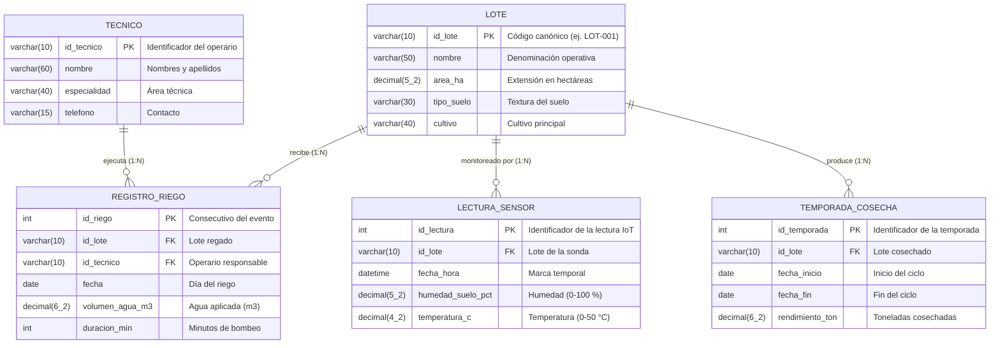

# Actividad Calificable · Corte 2
## Modelo, consulta y limpieza de datos
### 🌱 Caso: Gestión del Riego Agroindustrial basada en Datos

```yaml
# CONFIG
FULL_NAME: Isabella Ramos Betancourt
GITHUB_USER: Isarb-21
```

**Isabella Ramos Betancourt**  
Facultad de Ingeniería, Corporación Universitaria del Huila (CORHUILA)  
Ciencia de Datos (Cód. 69109) [Pénsum 40D, Grupo 1]  
Profesor: Jesús Ariel Gonzáles Bonilla  
Octubre de 2026

**Archivos de la entrega (carpeta `09-week/`):**

| Archivo | Contenido |
|---|---|
| [`Actividad_Corte2.ipynb`](Actividad_Corte2.ipynb) | Limpieza, verificación antes/después y las dos consultas, con salidas reales |
| `lectura_sensor_raw.csv` | Dataset bruto de telemetría |
| `lectura_sensor_clean.csv` | Dataset limpio generado por el cuaderno |

---

## 1. Introducción

Este trabajo consolida el Corte 2 de Ciencia de Datos: modelamiento relacional, limpieza de datos con pandas y consultas analíticas. El caso es la **Gestión del Riego Agroindustrial basada en Datos**. Según la FAO (2026), gestionar bien el agua exige integrar telemetría de campo (humedad y temperatura), bitácoras de riego y registros de productividad por temporada.

El código y las salidas completas están en el cuaderno [`Actividad_Corte2.ipynb`](Actividad_Corte2.ipynb). Este README resume el modelo, la limpieza y los hallazgos; todas las cifras provienen de esa ejecución.

---

## 2. Modelo de datos (ERD) — [1.5 pts]

El modelo tiene **cinco entidades**. El rendimiento se separa en `TEMPORADA_COSECHA` porque un lote tiene varias cosechas a lo largo del tiempo y una sola columna en `LOTE` se sobrescribiría con cada ciclo.



**Cardinalidades:**

1. `LOTE` → `REGISTRO_RIEGO` (1:N): un lote recibe muchos riegos; cada riego pertenece a un solo lote.
2. `TECNICO` → `REGISTRO_RIEGO` (1:N): un técnico ejecuta muchos riegos; cada riego tiene un responsable.
3. `LOTE` → `LECTURA_SENSOR` (1:N): un lote genera muchas lecturas; cada lectura pertenece a un solo lote.
4. `LOTE` → `TEMPORADA_COSECHA` (1:N): un lote tiene varias temporadas; el rendimiento es un atributo de la temporada.

Además, `REGISTRO_RIEGO` es la tabla intermedia de la relación N:M entre `LOTE` y `TECNICO`.

---

## 3. Limpieza de datos con pandas — [2.0 pts]

Dataset: `lectura_sensor_raw.csv`, lecturas de sensores de suelo de los lotes `LOT-001`, `LOT-002` y `LOT-003`. El detalle paso a paso, con el código y las salidas, está en la sección 1 a 3 del cuaderno.

**Reglas aplicadas:**

1. `id_lote` se reconstruye al formato canónico `LOT-XXX` extrayendo el número.
2. `fecha_hora` se convierte a `datetime`. Las fechas ISO (`AAAA-MM-DD`) se leen aparte de las que vienen como día/mes/año, para no confundir el día con el mes.
3. `temperatura_c` se convierte a número; el texto inválido pasa a nulo.
4. Se eliminan los duplicados exactos, ya con claves y fechas normalizadas.
5. Humedad fuera de [0, 100] % y temperatura fuera de [0, 50] °C pasan a nulo.
6. Los nulos se imputan con la **mediana por lote**.

**Reporte antes / después:**

| Métrica | Antes | Después |
|---|---|---|
| Filas | 75 | 72 |
| Duplicados exactos | 3 | 0 |
| Variantes de `id_lote` | 7 | 3 |
| Tipo de `fecha_hora` | texto | `datetime64` |
| Tipo de `temperatura_c` | texto | `float64` |
| Humedad fuera de rango | 2 (150.0 y 135.5 %) | 0 |
| Temperatura fuera de rango | 0 | 0 |
| Valores imputados | 7 (4 de humedad: 2 nulos y 2 fuera de rango; 3 de temperatura: 1 nulo y 2 texto inválido) | 0 nulos |

> Estas cifras coinciden con la ejecución del cuaderno sobre `lectura_sensor_raw.csv`.

---

## 4. Consultas y hallazgos — [1.0 pt]

Las consultas se ejecutan en SQLite con las cinco tablas del ERD y claves foráneas activas. Los datos de lotes, técnicos, riegos y temporada son **datos de ejemplo**; las lecturas de sensores vienen del dataset limpio.

### Consulta 1 · Riegos del Lote Norte sobre su propio promedio (`WHERE`)

**Pregunta:** ¿En qué fechas `LOT-001` recibió más agua que el promedio de sus propios riegos?

```sql
SELECT fecha, volumen_agua_m3, duracion_min
FROM registro_riego
WHERE id_lote = 'LOT-001'
  AND volumen_agua_m3 > (SELECT AVG(volumen_agua_m3)
                         FROM registro_riego WHERE id_lote = 'LOT-001')
ORDER BY fecha;
```

**Hallazgo:** el promedio de riego de `LOT-001` es 3.43 m³ y solo el riego del **2026-09-05** lo supera, con 4.1 m³ (19.4 % por encima del promedio). Las lecturas de sensor del dataset corresponden únicamente al 2026-09-01, así que no hay datos de humedad del 05-sep: no se puede afirmar sobre-irrigación y queda como **hipótesis por verificar** con lecturas de ese día.

### Consulta 2 · Consumo y eficiencia hídrica por lote (`JOIN` + `GROUP BY`)

**Pregunta:** ¿Cuánta agua recibió cada lote dentro de su temporada y qué rendimiento se obtuvo por m³ y por hectárea?

El agua se suma primero por temporada (CTE) y luego se une con el rendimiento, para que un lote con varias temporadas no duplique filas ni infle la suma. La réplica en pandas con `groupby` coincide con el SQL (el cuaderno lo comprueba).

| Lote | Cultivo | Agua (m³) | Rendimiento (t) | t/m³ | m³/ha | t/ha |
|---|---|---|---|---|---|---|
| Este | Café castillo | 4.1 | 18.2 | 4.439 | 0.68 | 3.03 |
| Sur | Tomate chonto | 9.8 | 42.0 | 4.286 | 2.58 | 11.05 |
| Norte | Maíz dulce | 10.3 | 28.5 | 2.767 | 1.98 | 5.48 |

**Hallazgo:** el maíz recibió el mayor volumen de agua y obtuvo el menor rendimiento por m³. Aun así, **t/m³ no es comparable entre cultivos distintos** (sus requerimientos y rendimientos por hectárea son muy diferentes), y el rendimiento corresponde a toda la temporada mientras que los riegos cubren solo unos días de septiembre. Es un indicador orientativo: para decidir una inversión, como tecnificar el riego del maíz, hacen falta varias temporadas del mismo cultivo y la bitácora completa de riegos.

---

## 5. Data & cleaning — [0.5 pt]

The dataset used in this project (`lectura_sensor_raw.csv`) contains seventy-five IoT sensor readings of soil moisture and temperature recorded at hourly intervals across three agricultural parcels (`LOT-001`, `LOT-002` and `LOT-003`) on 1 September 2026 (24 readings per parcel). An initial inspection revealed several data quality problems: exact duplicate records caused by network retransmissions, inconsistent lot identifiers (for example `"lot002"`, `"LOT 001"` and `"lote-003"`), mixed timestamp formats, corrupted temperature strings such as `"ERROR_SENSOR"`, missing values, and physically impossible soil moisture readings above 100%. To fix them, a pipeline was built in Python with pandas that standardized lot identifiers to the `LOT-XXX` format, converted all timestamps to `datetime64`, coerced temperature to numeric values, removed the duplicates (75 to 72 rows), and replaced out-of-range values with nulls. All missing values were then imputed with the per-lot median so that each parcel keeps its own microclimatic profile, and the final dataset was verified to have no nulls, no duplicates and valid ranges. Two questions were answered with SQL queries and checked in pandas: (1) on which dates did irrigation in `LOT-001` exceed the average volume of its own irrigation events, and (2) how much water did each lot receive during its harvest season and what yield per cubic meter and per hectare was obtained.

---

## 6. Conclusiones

1. **Modelo normalizado:** separar `TEMPORADA_COSECHA` de `LOTE` evita que el rendimiento se sobrescriba en cada cosecha y permite comparar ciclos productivos.
2. **Calidad de datos demostrada:** la limpieza se verifica con código (sin nulos, sin duplicados, tipos y rangos válidos), y las cifras del informe salen de la ejecución del cuaderno.
3. **Decisiones con cautela:** la Consulta 1 señala un riego a revisar, pero la sobre-irrigación solo se confirma con lecturas de sensor de esa fecha. La Consulta 2 muestra diferencias de eficiencia entre lotes, que no deben leerse como una comparación directa entre cultivos distintos.

---

## 7. Referencias

* Food and Agriculture Organization of the United Nations (FAO). (2026). *Water data and resource assessment*. https://www.fao.org/land-water/water/water-data-and-resource-assessment
* IBM. (2024). *What is data quality?* IBM Think. https://www.ibm.com/think/topics/data-quality
* McKinney, W. (2022). *Python for Data Analysis* (3rd ed.). O'Reilly Media.
* Provost, F., & Fawcett, T. (2013). *Data Science for Business*. O'Reilly Media.
* Silberschatz, A., Korth, H. F., & Sudarshan, S. (2020). *Database System Concepts* (7th ed.). McGraw-Hill.
